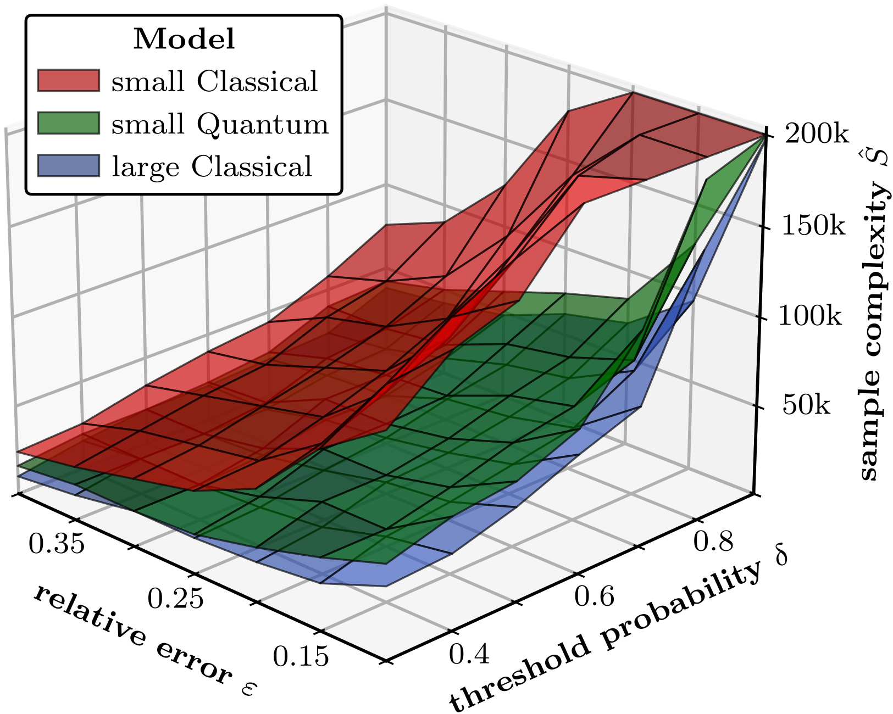

# Benchmarking Quantum Reinforcement Learning

[
](https://arxiv.org/search/quant-ph?searchtype=author&query=Meyer,+N) [](https://arxiv.org/search/quant-ph?searchtype=author&query=Meyer,+N)

This repo contains the code for the paper ["Benchmarking Quantum Reinforcement Learning", N. Meyer et al., arXiv:0000.00000 (2025)](https://arxiv.org/search/quant-ph?searchtype=author&query=Meyer,+N).

> Benchmarking and establishing proper statistical validation metrics for reinforcement learning (RL) remain ongoing 
> challenges, where no consensus has been established yet. The emergence of quantum computing and its potential 
> applications in quantum reinforcement learning (QRL) further complicate benchmarking efforts. To enable valid 
> performance comparisons and to streamline current research in this area, we propose a **novel benchmarking methodology**, 
> which is based on a **statistical estimator for sample complexity** and a **definition of statistical outperformance**. 
> Furthermore, considering QRL, our methodology casts doubt on some previous claims regarding its superiority. We 
> conducted experiments on a **novel benchmarking environment with flexible levels of complexity**. While we still identify 
> possible advantages, our findings are more nuanced overall. We discuss the potential limitations of these results and 
> explore their implications for empirical research on quantum advantage in QRL.



## Setup and Installation

This codebase requires an installation of `python v3.11` or older, as `tianshou` is currently not compatible with `v3.12`,
and following libraries:
- ```gym-6G v1.0```, automatically installs:
  * ``gymnasium v0.28.1``
  * ``matplotlib v3.9.0``
  * ``scipy v1.13.1``
- ```tianshou v1.0.0```
- ```torch v2.3.0```
- ```pennylane v0.36.0```

We recommend setting up a conda environment and install the required packages as follows:

```
conda create --name ENV_NAME python=3.11
conda activate ENV_NAME
cd gym-6G  # custom environment location
pip install .
cd ..  # parent folder
pip install -r requirements.txt
```

For using the 6G environment, just ``import gym_6G`` and set up as any gymnasium environment via ``gym.make('6G-v0')``.

## Reproducing Paper Results and Plots

> **Note on Reproducibility:** <br/>
> The results in the paper are averaged over 100 runs to robustly estimate the sample complexity.
> We did not enforce random seed during training, so re-running the training routines might lead to some -- very small -- deviations.

> **Downloading Pre-Computed Results:** <br/>
> Producing the full set of raw results for the paper is very computationally extensive,
> i.e. we expect it to take about 17.500 core hours on a typical 3.7GHz processor.<br/><br/>
> Therefore, we provide the pre-computed results: ADD LINK.<br/>
> Just place these in the `results` folder and run `unzip data.zip` to extract the files.

We provide a single bash script that can be used to re-produce the full data set underlying the results in the paper:
```angular2html
./train.sh
```
Note, that executing this script takes quite some time, and therefore should be offloaded to some HPC facilities.

Once the raw results have been produced -- or downloaded -- the scripts in the `plot/` folder can be used to reproduce 
the paper figures by running ```python plot/plot_figX.py```. This includes:
* `plot_fig1.py`: **Fig. 1**, i.e. surface plot of sample complexities with DDQN
* `plot_fig6.py`: **Fig. 6**, i.e. plot of sample complexities with DDQN, including error bars
* `plot_fig7.py`: **Fig. 7**, i.e. scaling behavior with increasing width / number of qubits
* `plot_fig8.py`: **Fig. 8**, i.e. absolute received energies for trained models (takes some time)
* `plot_fig16.py`: **Fig. 16** (appendix), i.e. plot of sample complexities with PPO, including error bars
* `plot_fig18a.py`: **Fig. 18(a)** (appendix), i.e. ablation study for classical models
* `plot_fig18b.py`: **Fig. 18(b)** (appendix), i.e. ablation study for quantum models
* `plot_fig19a.py`: **Fig. 19(a)** (appendix), i.e. task complexity for varying trajectory degrees
* `plot_fig19b.py`: **Fig. 19(b)** (appendix), i.e. task complexity for varying antenna numbers

The results will be stored under their respective names as pdf files in the folder `plot/plots/XXX.pdf`.

## Setting up the Environment 

The `gym_6G`, also referred to as `BeamManagement6G` environment, can be installed as described above.
One can customize the environment configuration as follows:

```angular2html
env = gym.make('6G-v0', size=(6.0, 6.0), steps=200, antennas=3, enforce_distance=0.0, trajectory_degree=3, mode='train')
```
With the settings and defaults as denoted above:
* `size`: The spatial dimension of the environment
* `steps`: The number of steps for each randomly sampled trajectory
* `antennas`: The number of randomly placed antennas -- here it is also possible to provide an explicit configuration
* `enforce_distance`: The Euclidean distance to enforce between pairwise antennas, in the paper we use `1.5`
* `trajectory_degree`: The number of support points for each randomly sampled trajectory
* `mode`: Running in `'train'` mode returns the absolute energy values, the `'val'` mode returns the relative values

It strictly follows the `gymnasium` API, i.e. supports the function calls
* `reset(SEED)`: Sets up a new environment instance, the optimal `SEED` can be used to enforce reproducible trajectories
* `step(ACTION)`: Selects the antenna indicated by `ACTION`, returns next state and received energy as reward
* `render()`: Displays the current environment state, requires setting the `render_mode` to `plot` or `text`

Additional information on how to use e.g. the different plotting functionalities supported by the environment are 
demonstrated in the file `gym-6G/test.py`.

## Training RL Agents

Training a classical RL model on the `BeamManagement6G` environment is as simple as running

```angular2html
python train.py --env_load=a3-main --method='dqn' --epochs_train=100 --model='classical' --width_nn=64 --depth_nn=2 --experiment='0'
```

and for a hybrid classical-quantum agent this changes to

```angular2html
python train.py --env_load=a3-main --method='dqn' --epochs_train=100 --model='quantum' --qubits_qnn=10 --layers_qnn=4 --experiment='0'
```

The algorithmic hyperparameters include:
* `--env_load`: Allows to load a pre-defined environment configuration from `env_configuration/`. Alternatively, it is also possible to randomize by setting only the number of antennas by `--env_antennas`.
* `--method`: The RL algorithm to use, currently we implemented `dqn` (i.e. double deep Q-networks) and `ppo` (i.e. proximal policy optimization).
* `--epochs_train`: The number of epochs to train for (with `--environments_train` trajectories of length `--env_steps` sampled in each epoch).
* `--model`: Use either classical or hybrid classical-quantum model.
* `--width_nn` / `--qubits_qnn`: Width of classical and quantum neural networks. 
* `--depth_nn` / `--layers_qnn`: Width of classical and quantum neural networks.
* `--experiment`: Path suffix for storing experiment results.

The training and validation logs are automatically stored to the `results\` folder, more concretely under the path
`results/ALGORITHM/ENV_CONF/TRAJ_DEGREE/MODEL[WIDTH-DEPTH]-EXPERIMENT.pkl`. 
The routine for extracting the sample complexities assumes this folder structure.

Information on further options for customizing the training routine can also be found in the `train.py` file.

## Extracting Sample Complexity

The sample complexity for several trained models can be extracted as using the `plots/sampling_complexity.py` script.
Moreover, cluster bootstrapping for estimating the percentiles is implemented in `plots/cluster_cootstrapping.py`.

Exemplary, the sample complexity for 100 classical DDQN agents can be extracted as
```angular2html
evaluate_sampling_complexity(os.path.join('results', 'dqn', 'a3-main', 'deg3'),  # model path
                             'C[64-2]',  # model configuration 
                             range(100),  # number of trained models
                             [0.2, 0.15, 0.1],  # fractional error, i.e. epsilon
                             [0.5, 0.3, 0.1]  # failure probability, i.e. delta)
```

More usage examples can be found in the various `figX_XXX.py` files, see the section on reproducing the paper results. 

## Acknowledgements

We acknowledge the use of the ...
* ... [`tianshou` library](https://tianshou.org/en/stable/) as a backend for RL training.
* ... [`gymnasium` API](https://gymnasium.farama.org/) for developing and structuring our `gym_6G` environment.
* ... [`torch` library](https://pytorch.org/docs/stable/torch.html) for training classical neural networks.
* ... [`pennylane` library](https://pennylane.ai/) for simulating and training quantum neural networks.
* ... [`qiskit-torch-module` library](https://github.com/nicomeyer96/qiskit-torch-module) for hyperparameter optimization of the QNNs.

We gratefully acknowledge the scientific support and HPC resources provided by the Erlangen [National High Performance 
Computing Center (NHR@FAU)](https://hpc.fau.de/) of the Friedrich-Alexander-Universität Erlangen-Nürnberg (FAU). 
The hardware is funded by the German Research Foundation (DFG). Composing and producing the results presented in this 
paper required about 40000 core hours of compute.

This research was conducted within the [**Bench-QC project**](https://www.iis.fraunhofer.de/de/profil/zukunftsinitiativen/quantentechnologien/bench-qc.html),
a lighthouse project of the [Munich Quantum Valley](https://www.munich-quantum-valley.de/) initiative, 
which is supported by the Bavarian state with funds from the Hightech Agenda Bayern Plus.

## Citation

If you use this implementation or results from the paper, please cite our work as

```
@article{meyer2025benchmarking,
  title={Benchmarking Quantum Reinforcement Learning},
  author={Meyer, Nico and Ufrecht, Christian and Yammine, George and Kontes, Georgios and Mutschler, Christopher and Scherer, Daniel D.},
  journal={arXiv:...},
  year={2025},
  doi={.../arXiv...}
}
```

## License

Apache 2.0 License
